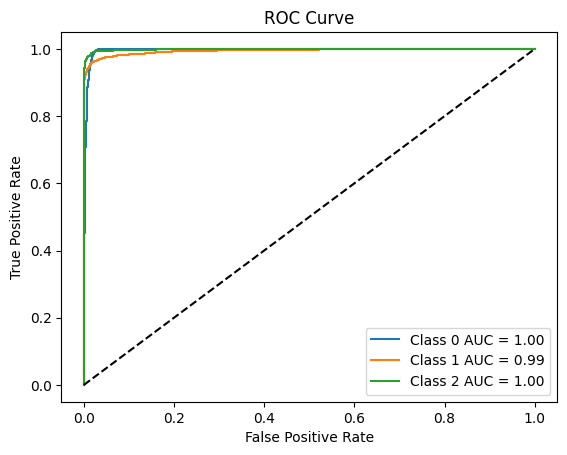
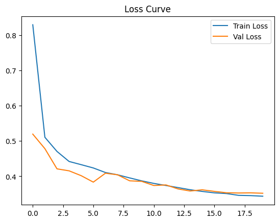
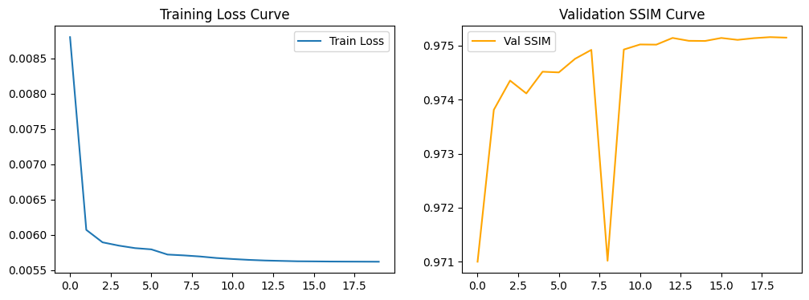
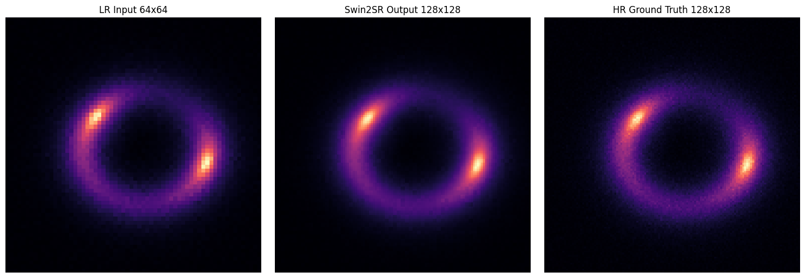
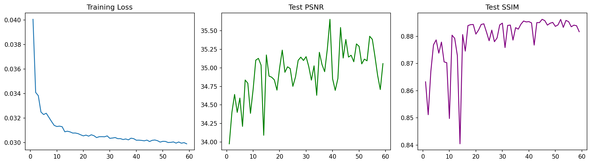
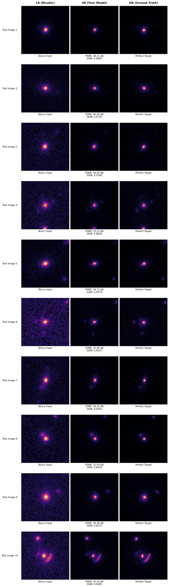

# DeepLense GSoC Assignment

This repository contains my implementation of the **DeepLense GSoC 2026 evaluation tasks**, including both **classification** and **image super-resolution** problems on gravitational lensing datasets.

---
### Trained models can be found at:  [Google Drive - Model Checkpoints](https://drive.google.com/drive/folders/1nTOxxWE1ZFNiCWoay157EovEnC6cX2L_?usp=sharing)  

---

##  Project Structure
```bash
  comman_test/
  │
  ├── other_experments/
  │ ├── image_classificationefficientnet_b3(300).ipynb
  │ ├── image_classificationefficientnet_b3(300)scheduld_learning_rate.ipynb
  │
  ├── comman_test.ipynb
  │
  project_task/
  │
  ├── task_1/
  │ ├── Task_VI_A.ipynb
  │
  ├── task_2/
  │ ├── outputs/
  │ │ ├── sample_visualizations.png
  │ │ ├── Tranning_Historys.png
  │ │
  │ ├── Task_VI_B.ipynb
  │
  README.md
```
---

##  Common Test I: Multi-Class Classification

### Dataset and Classes
The dataset consists of three types of gravitational lensing images:

- **No Substructure**
- **Sphere Substructure**
- **Vortex Substructure**

---

### Preprocessing Approach

- Resized images from **150×150 → 224×224**
- Applied **data augmentation**:
  - Random Horizontal Flip *(p = 0.5)*
  - Random Vertical Flip *(p = 0.5)*
  - Random Rotation *(0°–360°)*
- Improved generalization using augmentation techniques

---

### Model Architecture

Two state-of-the-art models were explored:

1. **ConvNeXt-Base (Best Model)**
2. **EfficientNet-B3**

#### Training Configuration (ConvNeXt-Base)
- Pretrained weights used
- Dropout: **0.3**
- Loss: **CrossEntropyLoss (label smoothing = 0.1)**
- Optimizer: **AdamW (lr = 1e-4, weight_decay = 1e-2)**
- Scheduler: **CosineAnnealingLR**
- Epochs: **20**

---

### Results

| Model                          | No Substructure | Sphere | Vortex |
|--------------------------------|----------------|--------|--------|
| **ConvNeXt-Base**              | 1.00           | 0.99   | 1.00   |
| EfficientNet-B3 (300×300)      | 0.98           | 0.95   | 0.98   |
| EfficientNet-B3 + Scheduler    | 0.98           | 0.96   | 0.98   |

---

###  Classification Results


###  Training History (Classification)


---

## Task VI.A: Super-Resolution on Simulated Data

### Dataset
- Simulated strong lensing images
- Paired **Low Resolution (LR)** and **High Resolution (HR)**
- No substructure

---

### Preprocessing

- LR: **75×75 → 64×64 (center crop)**
- HR: **150×150 → 128×128**
- Ensures compatibility with Swin Transformer
- Data split: **90% train / 10% validation**

---

### Model: Swin2SR (Transformer-Based SR)

- Transformer-based super-resolution model
- PixelShuffle upsampling for sharp reconstruction

#### Training Configuration
- Loss: **L1 Loss**
- Optimizer: **AdamW (lr = 2e-4)**
- Scheduler: **CosineAnnealingLR**
- Epochs: **20**

---

### Validation Results (1000 samples)

| Metric | Value |
|--------|------|
| MSE    | 0.00007577 |
| SSIM   | 0.9751 |
| PSNR   | 41.2477 dB |

---

### Training History (Task VI.A)


### Sample Output (Task VI.A)



---

## Task VI.B: Super-Resolution on Real Telescope Data

### Dataset
- **300 real image pairs**
- Sources: **HSC & HST telescopes**
- Limited dataset size

---

### Preprocessing & Augmentation

- Min-Max normalization
- Data augmentation:
  - Rotation (90°, 180°, 270°)
  - Horizontal & Vertical Flip
  - Noise Injection

---

### Model: EDSR (Best for Real Data)

- Residual-based SR architecture
- Effective for small datasets

---

### Results

#### Bicubic Baseline

| Metric | Value |
|--------|------|
| MSE    | 0.005888 |
| PSNR   | 23.58 dB |
| SSIM   | 0.3724 |

---

#### Final Model (EDSR)

| Metric | Value |
|--------|------|
| MSE    | 0.000683 |
| PSNR   | 35.6530 dB |
| SSIM   | 0.8853 |

---


### Training History (Task VI.B)
 

###  Super-Resolution Visualization (Task VI.B)


---

## Author
**Imrankhan**  
